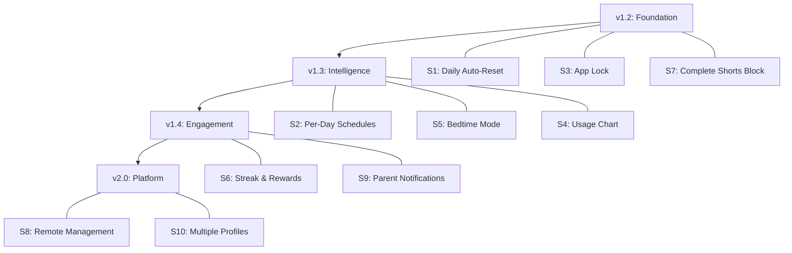

# MonsterTimer — Steal Like an Artist Plan

> *"Nothing is original. Steal from anywhere that resonates with inspiration or fuels your imagination."* — Austin Kleon

---

## The Competitive Landscape

### Who's Out There?

| App | Price | YouTube-Specific? | Approach |
|-----|-------|-------------------|----------|
| **YouTube Native Controls** | Free | ✅ Shorts-specific | Time limits (15min–2hr), complete Shorts blocking, bedtime reminders |
| **Qustodio** | $55–100/yr | ✅ YouTube monitoring | View search/watch history, block YouTube, set time limits, AI content alerts |
| **Bark** | $99/yr | ⚠️ General | AI content monitoring across 30+ apps, screen time schedules, content alerts |
| **Boomerang** | $16/yr | ✅ YouTube history | YouTube viewing history, per-day schedules, always-allowed apps |
| **Google Family Link** | Free | ⚠️ Device-level | App-level time limits, device schedules, location tracking |
| **Mobicip** | $49–99/yr | ⚠️ App blocking | Block YouTube entirely, schedules, web filtering |
| **MonsterTimer** | **Free** | **✅ Shorts-specific** | **Fun scary deterrent**, timer, custom monsters, PIN bypass |

### MonsterTimer's Unique Differentiators (Don't Lose These)
1. 🎯 **Hyper-focused** — Only targets YouTube Shorts (not the whole device)
2. 👹 **Fun & scary** — Uses gamification psychology vs. boring "time's up" dialogs
3. 🔊 **Multi-sensory** — Sound effects + visual overlay = memorable deterrent
4. 🆓 **100% free, no subscriptions** — Every competitor charges $50–100/yr
5. 🔒 **Zero data collection** — Privacy-first, no cloud, no accounts

---

## Feature Matrix: What to Steal

| Feature | YT Native | Qustodio | Bark | Boomerang | Family Link | MonsterTimer |
|---------|:---------:|:--------:|:----:|:---------:|:-----------:|:------------:|
| Shorts-specific timer | ✅ | ❌ | ❌ | ❌ | ❌ | ✅ |
| Complete Shorts block | ✅ | ❌ | ❌ | ❌ | ❌ | ❌ |
| Per-day schedules | ✅ | ✅ | ✅ | ✅ | ✅ | ❌ |
| Daily auto-reset | ✅ | ✅ | ✅ | ✅ | ✅ | ❌ |
| Always-allowed apps | ❌ | ✅ | ✅ | ✅ | ❌ | ❌ |
| Usage history chart | ❌ | ✅ | ✅ | ✅ | ✅ | ❌ |
| Content alerts (AI) | ❌ | ✅ | ✅ | ❌ | ❌ | ❌ |
| Bedtime/schedule mode | ✅ | ✅ | ✅ | ✅ | ✅ | ❌ |
| Remote management | ❌ | ✅ | ✅ | ✅ | ✅ | ❌ |
| Positive reinforcement | ❌ | ❌ | ❌ | ❌ | ❌ | ⚠️ Partial |
| Fun/gamified deterrent | ❌ | ❌ | ❌ | ❌ | ❌ | ✅ |
| Custom media overlay | ❌ | ❌ | ❌ | ❌ | ❌ | ✅ |
| PIN-protected bypass | ❌ | ❌ | ❌ | ❌ | ❌ | ✅ |
| App lock (self-protect) | ❌ | ✅ | ❌ | ❌ | ❌ | ❌ |
| Monitoring toggle | ❌ | ❌ | ❌ | ❌ | ❌ | ✅ |

---

## What to Steal (Prioritized)

### 🔴 Tier 1: Steal Immediately (High Impact, Low Risk)

#### S1: Daily Auto-Reset
**Stolen from:** Every competitor  
**Why:** Every single competitor resets limits daily. MonsterTimer forcing parents to manually clear expired timers is the #1 friction point.  
**Complexity:** 🟢 Easy (2–3 hours)

#### S2: Per-Day Schedules  
**Stolen from:** Boomerang, YouTube Native, Qustodio  
**Why:** Weekday vs weekend limits are table stakes. YouTube Native literally lets you set to 0 minutes on school days.  
**Complexity:** 🟡 Medium (4–6 hours)

#### S3: App Lock  
**Stolen from:** Qustodio  
**Why:** Kids will find and change settings. Qustodio locks its own app behind a PIN. MonsterTimer must do the same.  
**Complexity:** 🟢 Easy (2–3 hours)

---

### 🟡 Tier 2: Steal Soon (Differentiators)

#### S4: Usage History Chart  
**Stolen from:** Qustodio, Boomerang  
**Why:** Visual accountability is powerful. Both Qustodio and Boomerang show detailed reports. We already have the data; just need a chart view.  
**Complexity:** 🟡 Medium (4–6 hours)

#### S5: Bedtime / Blocked Schedule Mode  
**Stolen from:** YouTube Native, Bark  
**Why:** YouTube Native offers "Bedtime reminders." Bark has school/bedtime/free-time schedules. Parents want to automatically disable YouTube during homework or after 9 PM.  
**Complexity:** 🟡 Medium (4–6 hours)

#### S6: Streak & Rewards System (Make It Ours)  
**Stolen from:** Nobody (this is our innovation opportunity!)  
**Why:** No competitor does gamified positive reinforcement. We already track `timesStoppedEarly`. Turn this into a visible streak counter with emojis: "🌟 3-day good stop streak!"  
**Complexity:** 🟢 Easy (3–4 hours)

#### S7: Complete Shorts Block Mode  
**Stolen from:** YouTube Native  
**Why:** YouTube Native can now block Shorts entirely. We should offer a "Nuclear mode" that immediately shows the monster overlay when Shorts are opened — no timer, just instant block.  
**Complexity:** 🟢 Easy (2–3 hours)

---

### 🟢 Tier 3: Steal Later (Advanced)

#### S8: Remote Management via QR Code  
**Stolen from:** Qustodio, Bark, Google Family Link  
**Why:** All major competitors let parents manage from their own device. We can't build a full cloud service, but we can use a clever **QR code pairing** + local network sync to let a parent's phone push settings to the child's device.  
**Complexity:** 🔴 Hard (2–3 days)

#### S9: Notification Summary to Parent  
**Stolen from:** Bark  
**Why:** Bark's killer feature is sending parents a daily digest of concerning activity. We can send a daily notification summary: "Today: 22 min watched, 1 monster shown, 2 good stops."  
**Complexity:** 🟡 Medium (4–6 hours)

#### S10: Multiple Child Profiles  
**Stolen from:** Qustodio, Bark  
**Why:** Both support multiple children. Important for families.  
**Complexity:** 🔴 Hard (1–2 days)

---

## The MonsterTimer Advantage

> [!IMPORTANT]
> **Our unfair advantage is fun.** Every competitor is boring and corporate. MonsterTimer is the only parental control app that makes screen time management entertaining. Double down on this.

### Ideas to Amplify Our Uniqueness
- **Monster "Scare Level" slider** — Let parents customize how scary the overlay is (mild → terrifying)
- **Monster unlockables** — Kids unlock new (less scary) overlay themes by maintaining good stop streaks
- **Family leaderboard** — Multiple kids compete for the best streak
- **Monster of the Week** — Rotating default monster images to keep it fresh
- **Custom sound effects** — Let parents upload their own audio clips

---

## Recommended Implementation Order

